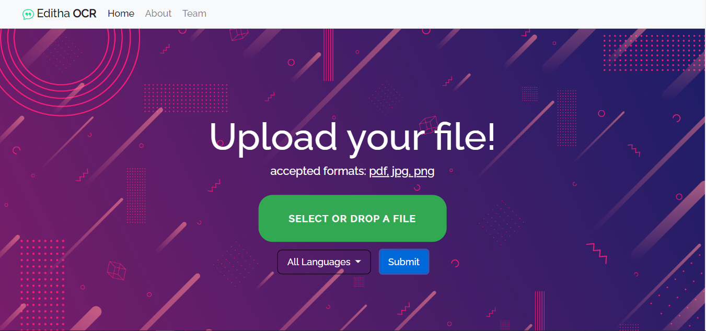
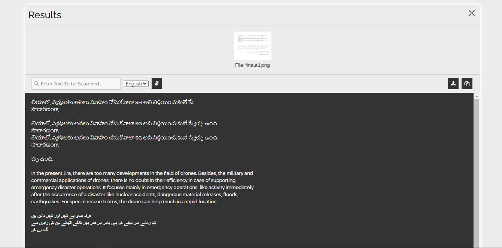
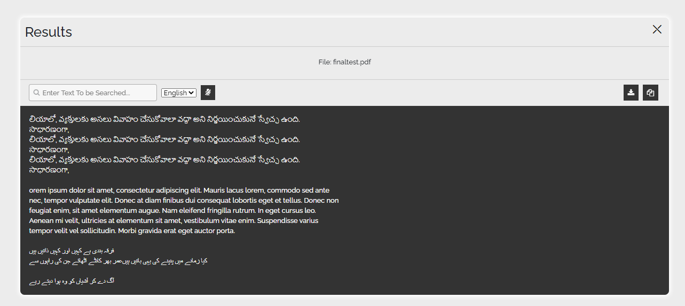
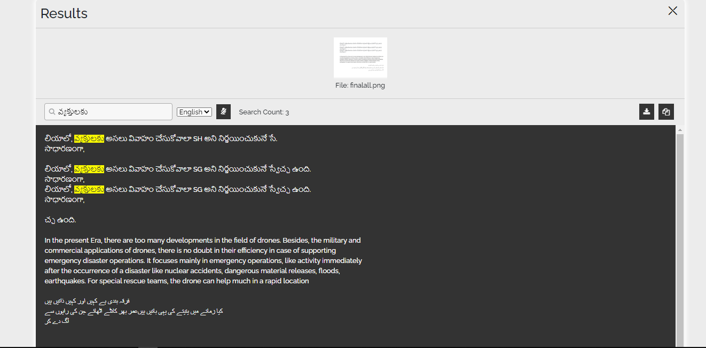

# SIH 2020
## KB145_Editha
### An OCR Software for English, Telugu and Urdu Languages
---
> Team members
* Abhishek Kumar (Team Leader)
* Ritik Gupta
* Harshita Madhok
* Abhishek Khatri
* Vaibhav Kumar
* Ashish

> Team Mentor
* Shobhit Bhatnagar

---
## How to make it work

open terminal in linux(Debian Based) or command prompt in windows

* clone the repository
	> git clone https://github.com/Abhishekkumar02/kb145_Editha
	>
	> cd kb145_Editha

* make virtual environment (optional)
	* linux
		> sudo apt install python3-venv
		>
		> python3 -m venv my-project-env
		>
		> source my-project-env/bin/activate
	* windows
		> pip install virtualenv
		>
		> virtualenv my-project-env
		>
		> my-project-env/Script/activate

* start the server
	* linux
		> ./main.sh
	* windows
		> main.bat

* open url http://127.0.0.1:5000 on your web browser

* select your file and the desired language

* Upload the file to perform the OCR operation! 

* We Added presentation in presentation dir in code!  

---

# Screenshots

## Homepage:

## Result:

### Image File:

### Pdf File:

## Searching:

